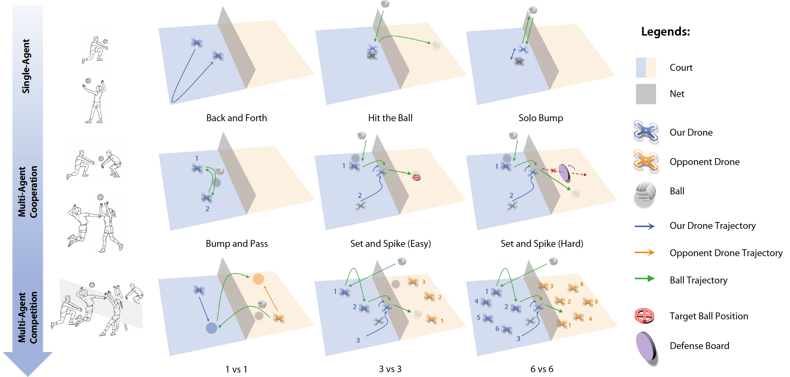

# VolleyBots: A Testbed for Multi-Drone Volleyball Game Combining Motion Control and Strategic Play

[](http://arxiv.org/abs/2502.01932)
[](https://sites.google.com/view/thu-volleybots/home)
[](https://docs.omniverse.nvidia.com/app_isaacsim/app_isaacsim/overview.html)
[](https://docs.python.org/3/whatsnew/3.10.html)
[](https://opensource.org/licenses/MIT)
[](https://github.com/thu-uav/VolleyBots)



Zelai Xu*, Ruize Zhang*, Chao Yu+, Huining Yuan, Xiangmin Yi, Shilong Ji, Chuqi Wang, Wenhao Tang, Feng Gao, Wenbo Ding, Xinlei Chen, Yu Wang+

(Corresponding Authors: {yuchao,yu-wang}@tsinghua.edu.cn)

**Contents**

- [Overview](#overview)
- [Installation](#installation)
- [Usage](#usage)
- [Pre-trained Models](#pre-trained-models)
- [Experimental Setup](#experimental-setup)
- [Citation](#citation)
- [Acknowledgement](#ackowledgement)

## Overview


**Overview of the VolleyBots Testbed**. VolleyBots comprises three key components: 
(1) Environment, supported by Isaac Sim and PyTorch, which defines entities, observations, actions, and reward functions; 
(2) Tasks, including 3 single-agent tasks, 3 multi-agent cooperative tasks and 3 multi-agent competitive tasks; and
(3) Algorithms, encompassing RL, MARL, game-theoretic algorithms.

## Installation

We use **Isaac Sim** as the simulation environment. You can choose to install the local version or the container version.

### Option 1: Install Local Version

#### 1. Isaac Sim

Download the [Omniverse Isaac Sim](https://developer.nvidia.com/isaac-sim) and install the desired Isaac Sim release following the [official document](https://docs.omniverse.nvidia.com/isaacsim/latest/installation/install_workstation.html). 

For this repository, we use the Isaac Sim version **2023.1.0-hotfix.1**. Since this version is not available on the official website, you can download it directly from [here](https://drive.google.com/file/d/1Rt4B3U3nGtnvqXrzTAEa6JcH5OaMxqfY/view?usp=sharing). After downloading, extract the file and move the folder to the following directory:

```bash
mv isaac_sim-2023.1.0-hotfix.1 ~/.local/share/ov/pkg/
```

Set the following environment variables to your ``~/.bashrc`` or ``~/.zshrc`` files :

```bash
# Isaac Sim root directory
export ISAACSIM_PATH="${HOME}/.local/share/ov/pkg/isaac_sim-2023.1.0-hotfix.1"
```

After adding the environment variable, apply the changes by running:

```bash
source ~/.bashrc
```

#### 2. Conda

Although Isaac Sim comes with a built-in Python environment, we recommend using a seperate conda environment which is more flexible. We provide scripts to automate environment setup when activating/deactivating a conda environment at ``VolleyBots/conda_setup``.

```bash
conda create -n volley python=3.10
conda activate volley

# at VolleyBots/
cp -r conda_setup/etc $CONDA_PREFIX
# re-activate the environment
conda activate volley
# install VolleyBots
pip install -e .

# verification
python -c "from omni.isaac.kit import SimulationApp"
# which torch is being used
python -c "import torch; print(torch.__path__)"
```

#### 3. Third Party Packages
VolleyBots requires specific versions of the `tensordict`, `torchrl` and `orbit` packages. For this repository, we manage these three packages using Git submodules to ensure that the correct versions are used. To initialize and update the submodules, follow these steps:

Get the submodules:
```bash
# at VolleyBots/
git submodule update --init --recursive
```

Install `tensordict`:
```bash
# at VolleyBots/
cd third-party/tensordict
python setup.py develop
```

Before install `torchrl`, first check and update gcc and g++:
```bash
# check gcc version, should be like: gcc (Ubuntu 9.4.0-1ubuntu1~20.04.2) 9.4.0 ...
gcc --version

# if not gcc 9.x, check available gcc
ls /usr/bin/gcc*

# if gcc-9 is not installed
sudo apt update && sudo apt install gcc-9
# if gcc-9 is installed
sudo update-alternatives --install /usr/bin/gcc gcc /usr/bin/gcc-9 100
sudo update-alternatives --config gcc
# then follow instructions to select gcc-9.

# check gcc version again
gcc --version

# apply same update and config to g++
```

Then install `torchrl`:

```bash
# at VolleyBots/
cd third-party/rl
python setup.py develop
```

Also we need to install `orbit` package of Isaac Sim. Note that currently `orbit` package has been integrated into `Isaac Lab` package, but this branch still uses the standalone `orbit` package (this can be updated in the future). So we manage the older version of `orbit` package using Git submodule. To install the `orbit` package, follow these steps: 

```bash
# at VolleyBots/
cd third-party/orbit
# create a symbolic link
ln -s ${ISAACSIM_PATH} _isaac_sim

# create environment variable
echo -e "alias orbit=$(pwd)/orbit.sh" >> ${HOME}/.bashrc
source ${HOME}/.bashrc

# building extentions
sudo apt install cmake build-essential
./orbit.sh --install  # or "./orbit.sh -i"
```

#### 4. Verification
```bash
# at VolleyBots/
cd scripts
python train.py headless=true wandb.mode=disabled total_frames=50000 task=SingleJuggleVolleyball task.env.num_envs=16
```

### Option 2: Install Container Version (using Docker)
The Container version is easier to set up compared to the Local version. However, it's important to note that the Container version does not support real-time rendering. Therefore, it only supports the command with ``headless=true``. You can save videos during training and upload them to Wandb. 

First, make sure your computer has installed ``Docker``, ``NVIDIA Driver`` and ``NVIDIA Container Toolkit``. Then, you should successfully run: 

```bash
# Verification
docker run --rm --runtime=nvidia --gpus all ubuntu nvidia-smi
```

Download the image from Docker Hub:
```bash
docker pull jimmyzhangruize/isaac-sim:2023.1.0-hotfix.1
```
This image already includes Isaac sim, so you don't neet to download Isaac sim. However, you need to clone the VolleyBots repository to your local computer because we use VolleyBots mounted in the container.

Then, run the image:
```bash
docker run --name *** --entrypoint bash -dit --gpus all -e "ACCEPT_EULA=Y" --rm --network=host \
-e "PRIVACY_CONSENT=Y" \
-v ~/docker/isaac-sim/cache/kit:/isaac-sim/kit/cache:rw \
-v ~/docker/isaac-sim/cache/ov:/root/.cache/ov:rw \
-v ~/docker/isaac-sim/cache/pip:/root/.cache/pip:rw \
-v ~/docker/isaac-sim/cache/glcache:/root/.cache/nvidia/GLCache:rw \
-v ~/docker/isaac-sim/cache/computecache:/root/.nv/ComputeCache:rw \
-v ~/docker/isaac-sim/logs:/root/.nvidia-omniverse/logs:rw \
-v ~/docker/isaac-sim/data:/root/.local/share/ov/data:rw \
-v ~/docker/isaac-sim/documents:/root/Documents:rw \
-v ***:/root/VolleyBots:rw \
-v /data:/data \
-e "WANDB_API_KEY=***" \
jimmyzhangruize/isaac-sim:2023.1.0-hotfix.1
```

Note that:
1. You need to replace *** in ```--name ***``` with the your docker image name.
1. You need to replace *** in ```-v ***:/root/VolleyBots:rw``` with the directory where VolleyBots is locally located in.
2. You need to replace *** in ```-e "WANDB_API_KEY=***"``` with your own WANDB_API_KEY. If you do not need to use Wandb, you can omit this line.
3. In the container, VolleyBots is located at ``/root/VolleyBots`` and Isaac-sim is located at ``/isaac-sim``.


Install VolleyBots in the container:
```bash
conda activate sim2
cd /root/VolleyBots
cp -r conda_setup/etc $CONDA_PREFIX
conda activate sim2 # re-activate the environment
pip install -e . # install VolleyBots
```

Verify you can successfully run VolleyBots in the container (use ``deploy`` branch):

```bash
cd /root/VolleyBots/scripts
python train.py headless=true wandb.mode=disabled total_frames=50000 task=SingleJuggleVolleyball task.env.num_envs=16
```

    
## Usage

<!-- TODO -->
### 1. Configuration

We use [`hydra`](https://hydra.cc/docs/intro/) to manage the configurations. You can find the configuration files in `cfg`.

File structure of the configuration files:

```bash
cfg
├── train.yaml # training configurations
├── task
│   ├── <TASKNAME>.yaml # configurations for each task
├── algo 
│   ├── <ALGONAME>.yaml # configurations for each algorithm
```

When you run the training script, you can modify the configurations in these yaml files, or you can pass the configurations as command line arguments. For example:

```bash
python train.py headless=true \
    total_frames=1_000_000_000 \
    task=Volleyball1v1 \
    task.drone_model=Iris \
    task.env.num_envs=2048 \
    task.env.env_spacing=18 \
    task.random_turn=True \
    task.initial.drone_0_near_side=True \
    task.symmetric_obs=True \
    eval_interval=300 \
    save_interval=300 \
    algo=mappo \
    algo.share_actor=true \
    algo.critic_input="obs" \
    seed=0 \
```

For experiment tracking, we use [`wandb`](https://wandb.ai/). You need to have a wandb account, and set the `wandb` configurations in the `train.yaml` file. For example:

```yaml
wandb:
  group: <EXPERIMENT_GROUP>
  run_name: <EXPERIMENT_NAME>
  job_type: train
  entity: <YOUR_WANDB_ENTITY>
  project: <YOUR_WANDB_PROJECT>
  mode: online # set to 'disabled' when debugging locally
  run_id:
  monitor_gym: True
  tags:
```

### 2. Training

To train a model, you can run the following command:

```bash
# at VolleyBots/scripts
python train.py <TRAIN_CONFIGS> <TASK_CONFIGS> <ALGO_CONFIGS>
```

We also provide example training scripts for each task included in our paper. You can find them in the `scripts/training_shell` directory. For example, to train a model for the `Volleyball1v1` task using `self-play`, you can run:

```bash
# at VolleyBots/scripts/training_shell
bash volleyball1v1_sp.sh
```

### 3. Evaluation

We include the example evaluation scripts from our paper in the `scripts/evalution_shell` directory. For example, to evalute the cross-play win rate between psro_uniform and psro_nash on the `Volleyball3v3` task, you can run:

```bash
# at VolleyBots/scripts/evaluation_shell
bash volleyball3v3_crossplay.sh
```

## Pre-trained Models
We offers trained checkpoints at ``VolleyBots/checkpoints`` directory for evaluating exploitability and cross-play win rates, and we also include hierarchical policy checkpoints for competing against the self-play baseline in the 3 vs 3 task.

## Experimental Setup

Our experiments were run on a workstation with:

* **GPU**: NVIDIA GeForce RTX 4090
* **RAM**: 128 GB
* **OS**: Ubuntu 20.04 LTS
* **Software**: CUDA 12.4

## Citation

Please cite [our paper](https://arxiv.org/abs/2502.01932) if you find our work useful:

```bibtex
@misc{xu2025volleybotstestbedmultidronevolleyball,
      title={VolleyBots: A Testbed for Multi-Drone Volleyball Game Combining Motion Control and Strategic Play}, 
      author={Zelai Xu and Ruize Zhang and Chao Yu and Huining Yuan and Xiangmin Yi and Shilong Ji and Chuqi Wang and Wenhao Tang and Feng Gao and Wenbo Ding and Xinlei Chen and Yu Wang},
      year={2025},
      eprint={2502.01932},
      archivePrefix={arXiv},
      primaryClass={cs.RO},
      url={https://arxiv.org/abs/2502.01932}, 
}
```

## Ackowledgement

This repository is heavily based on [OmniDrones](https://github.com/btx0424/OmniDrones).

Some of the abstractions and implementation was heavily inspired by [Isaac Orbit](https://github.com/NVIDIA-Omniverse/Orbit).
